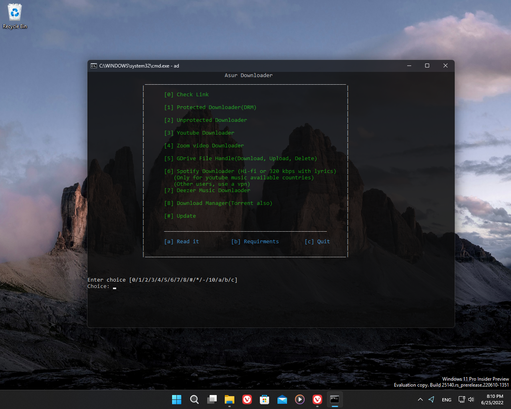

<!-- PROJECT LOGO -->
 

  

  <h3 align="center">Asur Downloader</h3>

  

    An awesome video, music & torrent downloader & Cloud file handler!
     
    <a href="https://github.com/Asur2-5356202/AsurDownloader/blob/main/Asur%20Downloader.bat">View source code</a>
    ·
    <a href="https://github.com/Asur2-5356202/AsurDownloader/issues">Report Bug</a>
    ·
    <a href="https://github.com/Asur2-5356202/AsurDownloader/issues">Request Feature</a>
    .
    <a href="https://github.com/Asur2-5356202/AsurDownloader/releases">Releases</a>
    .
  

  
<!-- TABLE OF CONTENTS -->

  
Table of Contents

  <ol>
    <li>
      <a href="#about-the-project">About The Project</a>
      <ul>
        <li><a href="#built-with">Built With</a></li>
      </ul>
    </li>
    <li>
      <a href="#installation">Installation</a>
    </li>
    <li><a href="#usage">Usage</a></li>
  </ol>

## About The Project

This is a small program which wrote with batch programming in order to make easy to use yt-dlp, ffmpeg, aria2 and etc.

(<a href="#top">back to top</a>)

### Built With

* [Spotdl](https://nextjs.org/)
* [Aria2](https://aria2.github.io)
* [YT-DLP](https://github.com/yt-dlp/yt-dlp)
* [Youtube-dl](https://github.com/ytdl-org/youtube-dl)
* [FFmpeg](https://ffmpeg.org)
* [Bento4](https://www.bento4.com)
* [gdrive](https://github.com/prasmussen/gdrive)

(<a href="#top">back to top</a>)

## Installation

1) Download released package
2) Extract files in to folder
3) Install python
4) After run pip install spotdl

(<a href="#top">back to top</a>)

